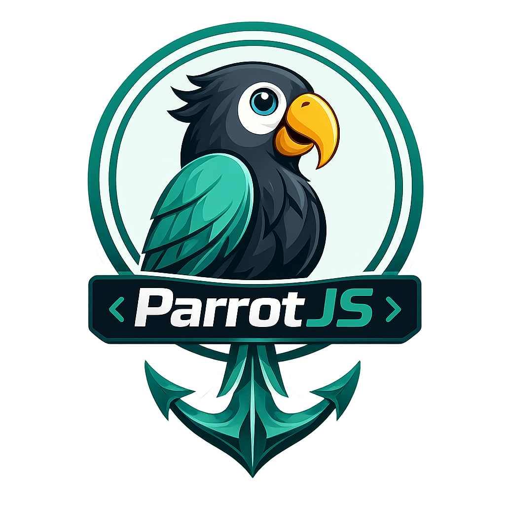

  

<h1 align="center">ParrotDev Issues</h1>

  <strong>Issue tracking & feature requests for the ParrotDev extension suite</strong>

  <a href="https://parrotdev.com">🌐 Website</a> •
  <a href="https://marketplace.visualstudio.com/publishers/ParrotDev">📦 VS Code Marketplace</a>

---

This repository is the central place to **report bugs**, **request features**, and **ask questions** about the [ParrotDev](https://parrotdev.com) extension suite for VS Code.

### Extensions

| Extension | Language | Status |
|-----------|----------|--------|
| **ParrotJS** | JavaScript / TypeScript | ✅ Available |
| **ParrotPython** | Python | 🔜 Coming soon |
| **ParrotPHP** | PHP | 🔜 Coming soon |

### Before submitting an issue

1. **Search** [existing issues](https://github.com/raviraushanweb/parrotdev-issues/issues) — yours may have already been reported.
2. Check the [ParrotDev website](https://parrotdev.com) for documentation and FAQs.
3. Make sure you're on the latest version of the extension.

### Quick links

- [Report a bug](https://github.com/raviraushanweb/parrotdev-issues/issues/new?template=bug_report.yml)
- [Request a feature](https://github.com/raviraushanweb/parrotdev-issues/issues/new?template=feature_request.yml)
- [Security policy](SECURITY.md)
- [Contributing guidelines](CONTRIBUTING.md)
